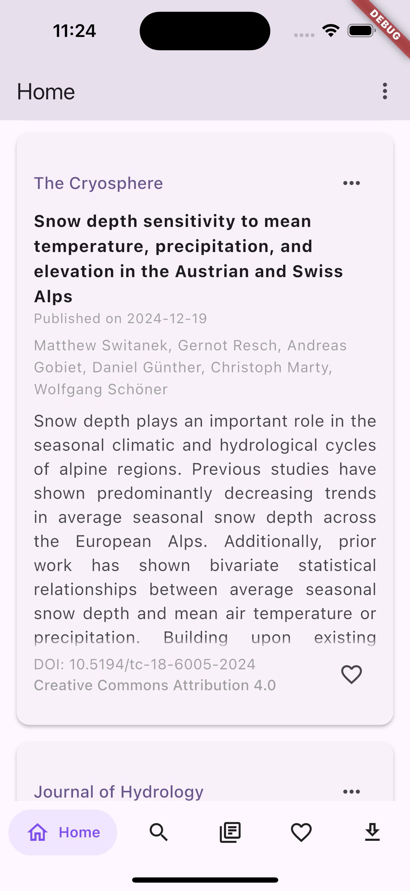
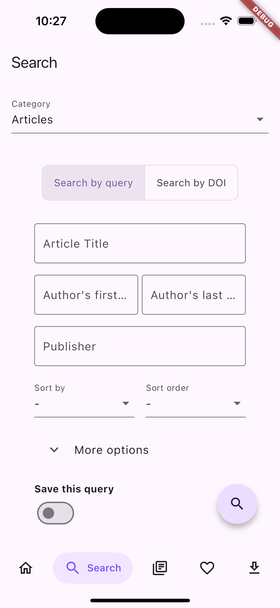
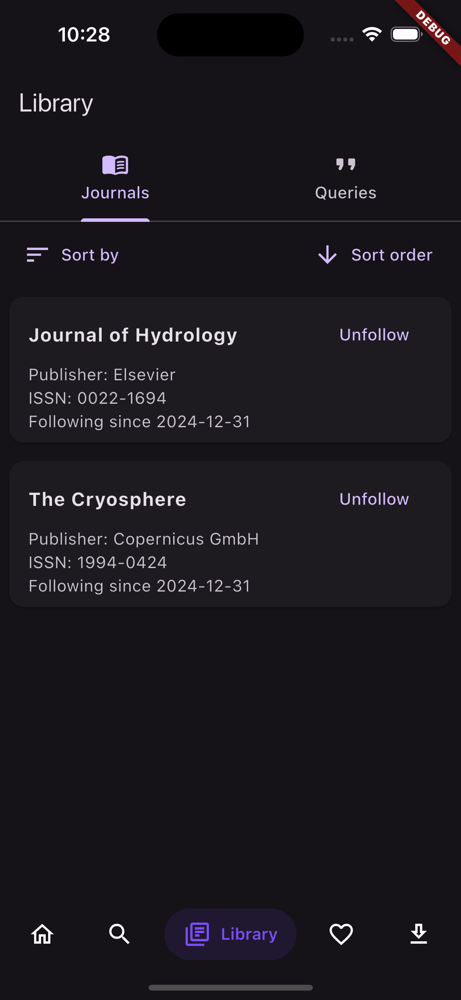
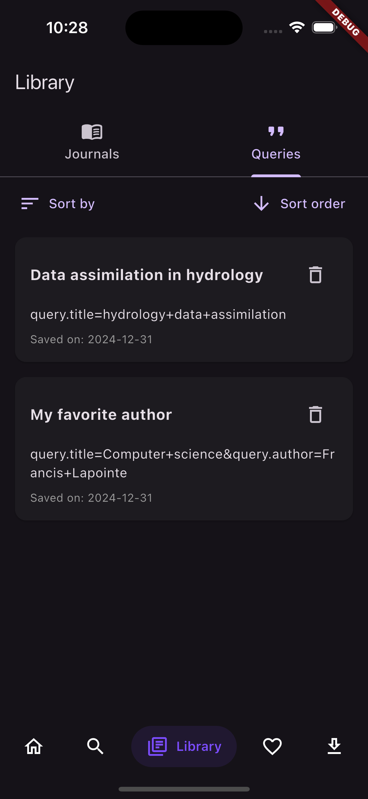
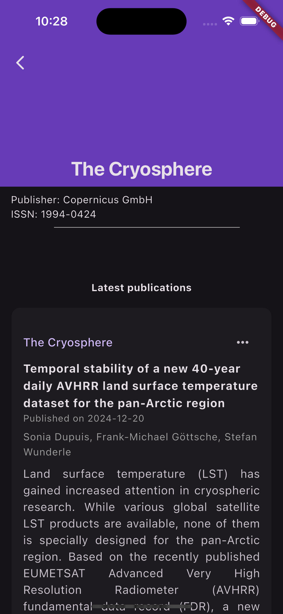
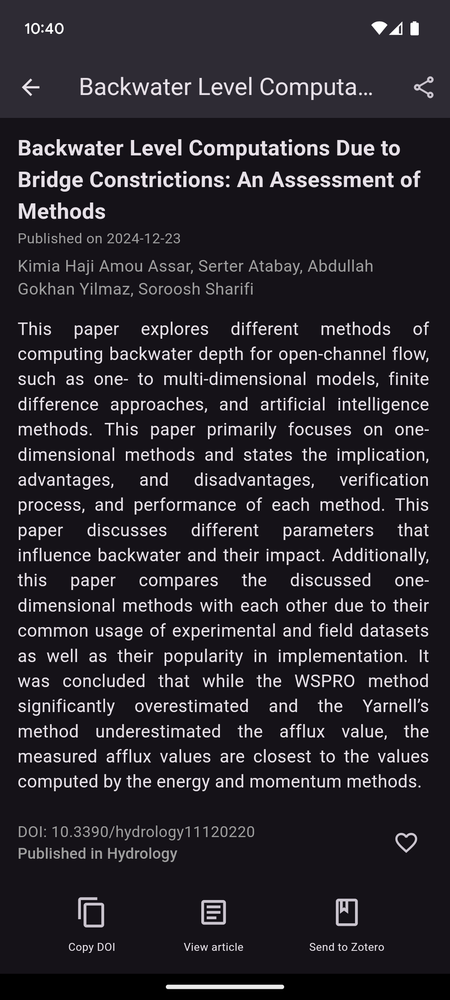

<h3 align="center">Stay up-to-date with articles in your field of study!</h3>

  

---

> [!IMPORTANT]
> Wispar is currently in closed testing before being published on the Play Store. ~~Google requires a minimum of 12 testers, and **I need your help!** If you'd like to test the app and provide feedback, please send me your email at wispar-app@protonmail.com, and I'll add you to the closed testing group.~~ Thank you to everyone who spent time testing Wispar and providing valuable feedback, I appreciate it! As of January 13th, there are just 6 days left until I can submit the app for review. If approved, I’ll be able to send it for review on the production channel!
>
>Once Wispar is live on the Play Store, I will also look into publishing it on the App Store and F-Droid.

## Description

Wispar is a user-friendly and privacy-friendly Android/iOS app that seamlessly searches scientific journals and articles using the Crossref API. Stay updated on your preferred journals by following them and receive new article abstracts in your main feed. No account required. The integration of Unpaywall ensures convenient access to open-access articles, while EZproxy helps overcome subscription barriers.  

## Screenshots

| Home screen (light)                                       | Search screen (light)                                | Journals screen(dark)                                          |
|---------------------------------------------------|------------------------------------------------------|---------------------------------------------------------|
|             |    |   |

| Queries screen (dark)                              | Journal latest works (dark)                               | Abstract (dark)                                          |
|---------------------------------------------------|------------------------------------------------------|---------------------------------------------------------|
|  |  |       |

## Features overview
<ul>
    <li> [x] Search and follow journals</li>
    <li> [x] Search for articles and save the queries for easy access later</li>
    <li> [x] Download articles for offline access *</li>
    <li> [x] EZproxy and Unpaywall integration</li>
    <li> [x] Send articles to Zotero</li>
    <li> [x] Share articles</li>
</ul>
* The download feature is currently limited to open access articles. Flutter tools and publishers like Elsevier and Wiley make it hard to get the PDF file behind their paywall.

## Translations

Wispar uses Weblate to manage translations. You can find the hosted instance at <a href="https://hosted.weblate.org/engage/wispar/">https://hosted.weblate.org/engage/wispar/</a>

A huge thank you to Weblate for hosting the translations for free :heart:.

Translation status:

## Contribute

    <ul>
        <li>There are many ways you can contribute to improving Wispar—and it's not just about writing code!</li>
        <li>You can help translate Wispar into your language by using our hosted Weblate instance.</li>
        <li>Additionally, providing feedback and reporting bugs are invaluable ways to contribute!</li>
    </ul>

## Help

If you run into any issue while using Wispar, have a question or want to share your feedback, please open an issue here : https://github.com/Scriptbash/Wispar/issues

## Credits
<ul>
    <li><a href="https://libproxy-db.org/" target='_blank'>Library Proxy URL Database</a></li>
    <li><a href="https://unpaywall.org/" target='_blank'>Unpaywall</a></li>
    <li><a href="https://www.crossref.org/" target='_blank'>Crossref</a></li>
</ul>

## FAQ
 <b>Q</b>: The journal subjects are missing or are incorrect 
<b>A</b>: This is a problem with the Crossref API that originates from Scopus. The subjects metadata from Crossref may be removed in the future though according to this <a href="https://community.crossref.org/t/retrieve-subjects-and-subject-from-journals-and-works/2403/6" target="_blank">thread</a>. 

<b>Q</b>: My institution's EZproxy URL is missing or is incorrect 
<b>A</b>: If you can view the list of proxies correctly in the app but notice that your institution is missing or has an incorrect URL, please report the issue to the EZproxy-db by opening a new <a href="https://github.com/tom5760/ezproxy-db/issues/new/choose" target="_blank">issue</a> in their repository. Otherwise, please open a new issue in Wispar's repository. 
