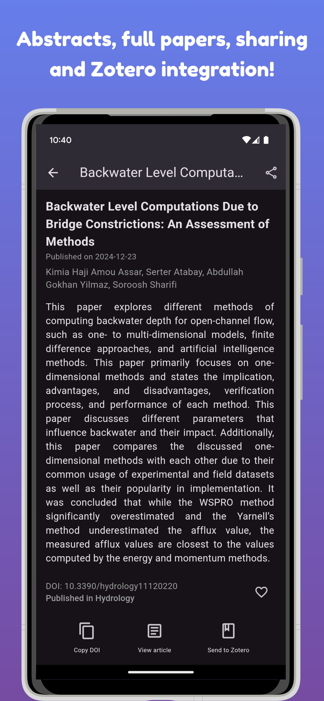
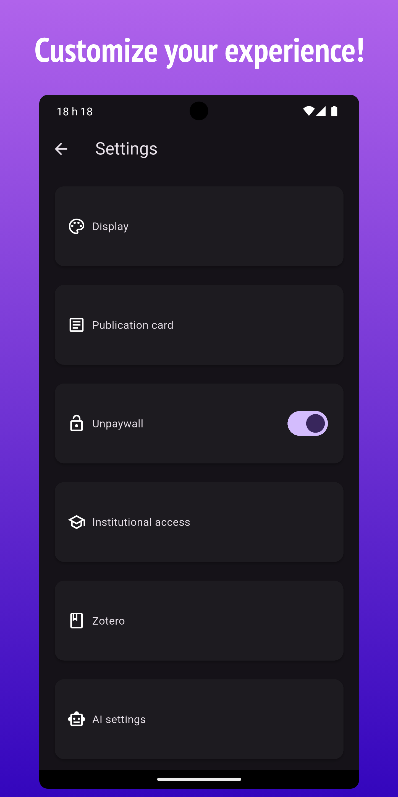

  

<h3 align="center">Stay up-to-date with academic journals and the latest research articles!</h3>

  
  
  

  
  
  
   
  
  
  <!--
  -->

  

---

## Description

Wispar is a user-friendly and privacy-friendly app for Android, iOS, Windows, MacOS and Linux that seamlessly searches scientific journals and articles using the Crossref and OpenAlex APIs. Stay updated on your preferred journals by following them and receive new article abstracts in your main feed. No account required. The integration of Unpaywall ensures convenient access to open-access articles, while EZproxy helps overcome subscription barriers.  

## Features overview

- [x] Search and follow journals
- [x] Search for articles and save the queries for easy access later. You can even include them in your feed!
- [x] Sync your database across devices. You can also self-host the sync backend! 
- [x] Download articles for offline reading
- [x] EZproxy and Unpaywall integration
- [x] Send articles to Zotero
- [x] Share articles
- [x] Scrape missing abstracts
- [x] Scrape graphical abstracts
- [x] Export/Import the local database
- [x] Notifications and background journals updates
- [x] Create custom feeds
- [x] Customizable swipe gestures
- [x] Translate title and abstracts (requires an AI API key)
- [x] Chat with your papers using AI

## Translations

Wispar uses Weblate to manage translations. You can find the hosted instance at [https://hosted.weblate.org/engage/wispar/](https://hosted.weblate.org/engage/wispar/)

A huge thank you to Weblate for hosting the translations for free :heart:.

Translation status:

## Contribute

There are many ways you can contribute to improving Wispar, and it's not just about writing code!

* **Translations:** Help translate Wispar into your language using the [hosted Weblate instance](https://hosted.weblate.org/engage/wispar/).
* **Documentation:** Help me expand and finish the [official docs](https://wispar.app/docs/intro). It is currently a work in progress and any help is greatly appreciated!
* **Feedback:** Reporting bugs and suggesting features via [GitHub Issues](https://github.com/Scriptbash/Wispar/issues) is also an invaluable way to contribute!

**If you contribute to the project, feel free to add yourself to the `.zenodo.json` file to be credited!**

## Help

If you run into any issue while using Wispar, have a question or want to share your feedback, please [open an issue here](https://github.com/Scriptbash/Wispar/issues). 

If you have an issue with your Wispar Sync account, you can send an email at [support[at]wispar.app](mailto:support@wispar.app) and I will try to help as soon as possible.

## Credits

- Thank you [Sergio](https://github.com/reds2401) for the original app icon and [Lingling](https://github.com/Meigane) for the updated app icon!
- [Library Proxy URL Database](https://libproxy-db.org/) 
- [Unpaywall](https://unpaywall.org/)
- [Crossref](https://www.crossref.org/)
- [OpenAlex](https://openalex.org/)
- [PocketBase](https://pocketbase.io/)

## Screenshots

|  |  |  |
|---|---|---|
|  |  |  |
