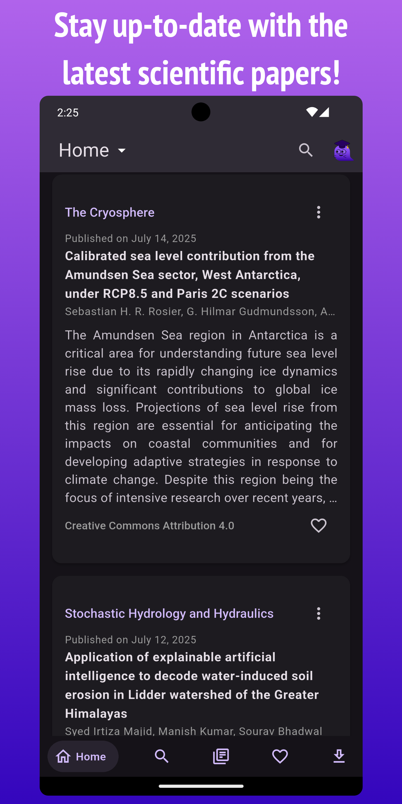
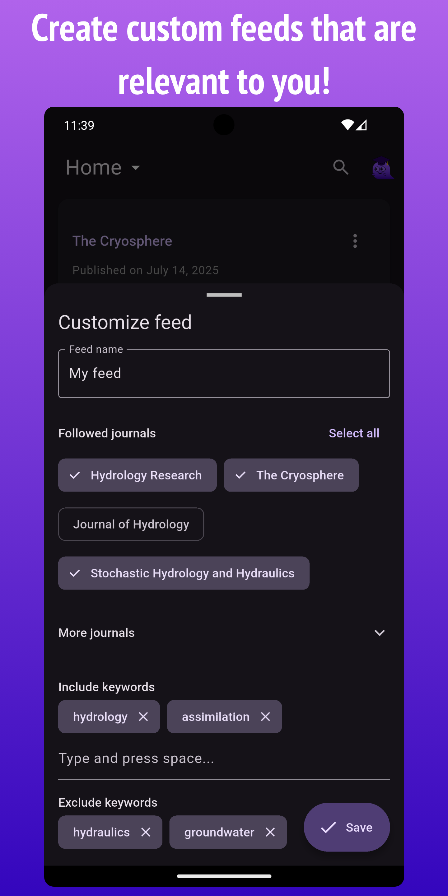
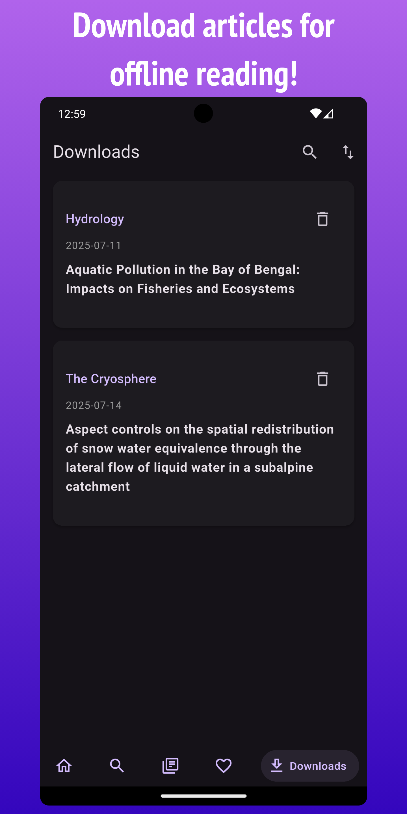

<h3 align="center">Stay up-to-date with articles in your field of study!</h3>

 

 

  

---

## Description

Wispar is a user-friendly and privacy-friendly Android/iOS app that seamlessly searches scientific journals and articles using the Crossref and OpenAlex APIs. Stay updated on your preferred journals by following them and receive new article abstracts in your main feed. No account required. The integration of Unpaywall ensures convenient access to open-access articles, while EZproxy helps overcome subscription barriers.  

## Features overview
<ul>
    <li> [x] Search and follow journals</li>
    <li> [x] Search for articles and save the queries for easy access later</li>
    <li> [x] Download articles for offline access *</li>
    <li> [x] EZproxy and Unpaywall integration</li>
    <li> [x] Send articles to Zotero</li>
    <li> [x] Share articles</li>
    <li> [x] Scrape missing abstracts</li>
    <li> [x] Export/Import the database</li>
    <li> [x] Filters</li>
</ul>
* The download feature is currently limited to some publishers. Flutter tools and publishers like Elsevier and Wiley make it hard to get the PDF file.

### Planned features
<ul>
    <li> [ ] Deep links</li>
    <li> [ ] Get downloads working for more publishers</li>
    <li> [ ] Notifications and background journals updates</li> 
</ul>
</ul>

## Translations

Wispar uses Weblate to manage translations. You can find the hosted instance at <a href="https://hosted.weblate.org/engage/wispar/">https://hosted.weblate.org/engage/wispar/</a>

A huge thank you to Weblate for hosting the translations for free :heart:.

Translation status:

## Contribute

    <ul>
        <li>There are many ways you can contribute to improving Wispar—and it's not just about writing code!</li>
        <li>You can help translate Wispar into your language by using our hosted Weblate instance.</li>
        <li>Additionally, providing feedback and reporting bugs are invaluable ways to contribute!</li>
    </ul>
    <b>If you contribute to the project, feel free to add yourself to the .zenodo.json file to be credited!</b>

## Help

If you run into any issue while using Wispar, have a question or want to share your feedback, please open an issue here : https://github.com/Scriptbash/Wispar/issues

## Credits
<ul>
    <li>Thank you<a href="https://github.com/reds2401" target='_blank'> Sergio </a>for the app icon!</li>
    <li><a href="https://libproxy-db.org/" target='_blank'>Library Proxy URL Database</a></li>
    <li><a href="https://unpaywall.org/" target='_blank'>Unpaywall</a></li>
    <li><a href="https://www.crossref.org/" target='_blank'>Crossref</a></li>
    <li><a href="https://openalex.org/" target='_blank'>OpenAlex</a></li>
</ul>

## Screenshots

|  |  |  |
|---|---|---|
|  |  |  |
